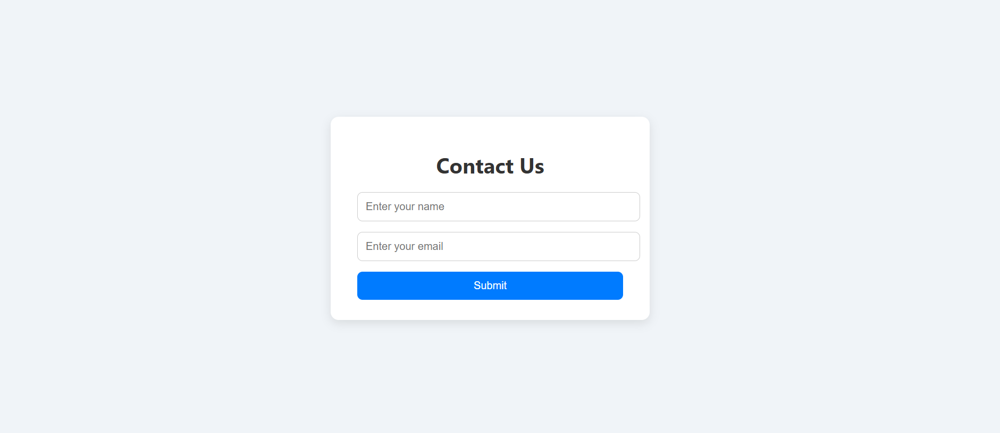

# 📬 Contact Form Web App

A simple contact form web application with:

- ✅ Frontend: HTML, CSS, JS
- ✅ Backend: Node.js (Express) + PHP (optional)
- ✅ Database: MySQL

Submitted form data is stored securely in a MySQL database.

---

## 🌐 Live Preview

Access the app at:  
**http://13.204.45.180:4000**

---

## 📁 Project Structure
```
contact-form/
├── public/
│ └── index.html # Frontend form
├── server.js # Node.js backend
├── db.js # MySQL config
├── package.json # Node dependencies
```

---

## 🛠️ Installation

### 1. Clone the repo

```bash
git clone https://github.com/DhruvShah0612/database_sql.git
cd database_sql
```

### 2. Install Node.js dependencies
```bash
npm install
```

### 3. MySQL Database Setup
```
Login to MySQL and run:

CREATE DATABASE demo_db;
USE demo_db;

CREATE TABLE contacts (
  id INT AUTO_INCREMENT PRIMARY KEY,
  name VARCHAR(100),
  email VARCHAR(100)
);
```
### 4. Configure db.js
```
Edit db.js and update with your MySQL credentials:

const db = mysql.createConnection({
  host: "localhost",
  user: "root",               // Change if using another user
  password: "your_password", // Set your DB password
  database: "demo_db"
});
```

### 5. Run the App
```bash
node server.js
```
## 📸 Form Preview


